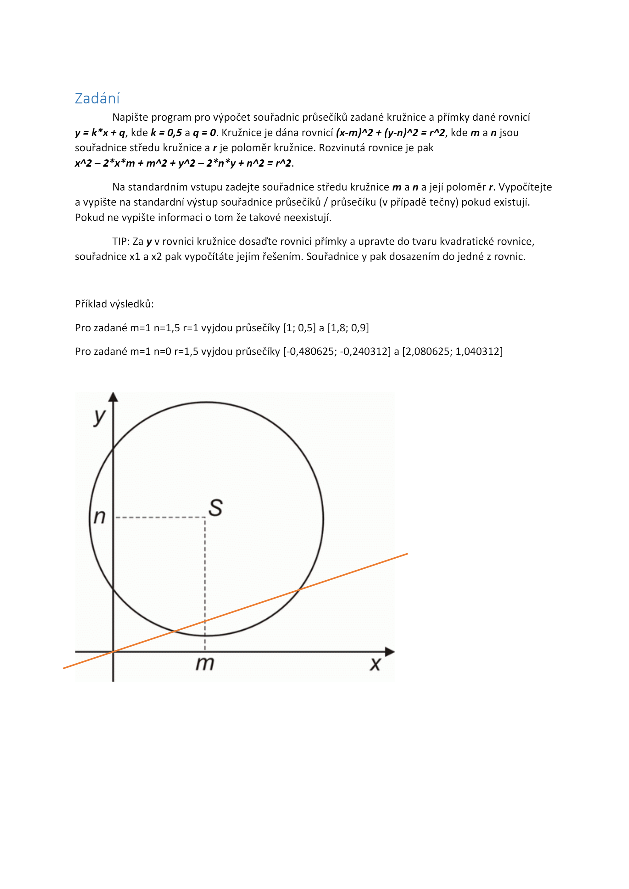

# Zadání
Napište program pro výpočet souřadnic průsečíků zadané kružnice a přímky dané rovnicí `y = k*x + q, kde k = 0,5 a q = 0`. Kružnice je dána rovnicí `(x-m)^2 + (y-n)^2 = r^2`, kde m a n jsou souřadnice středu kružnice a r je poloměr kružnice. Rozvinutá rovnice je pak x^2 – 2*x*m + m^2 + y^2 – 2*n*y + n^2 = r^2.
Na standardním vstupu zadejte souřadnice středu kružnice m a n a její poloměr r. Vypočítejte a vypište na standardní výstup souřadnice průsečíků / průsečíku (v případě tečny) pokud existují. Pokud ne vypište informaci o tom že takové neexistují.
TIP: Za y v rovnici kružnice dosaďte rovnici přímky a upravte do tvaru kvadratické rovnice, souřadnice x1 a x2 pak vypočítáte jejím řešením. Souřadnice y pak dosazením do jedné z rovnic.
Příklad výsledků:
```
Pro zadané m=1 n=1,5 r=1 vyjdou průsečíky [1; 0,5] a [1,8; 0,9]
Pro zadané m=1 n=0 r=1,5 vyjdou průsečíky [-0,480625; -0,240312] a [2,080625; 1,040312]
```

